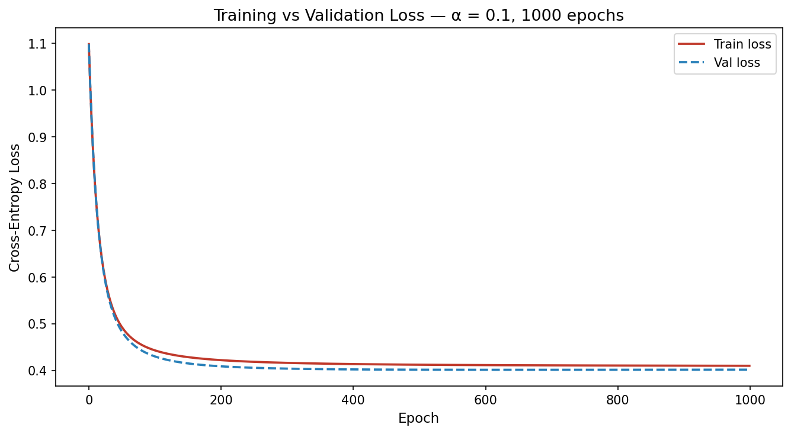
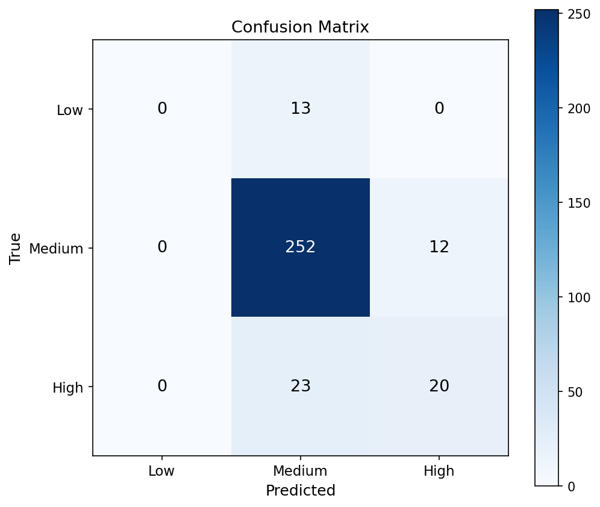
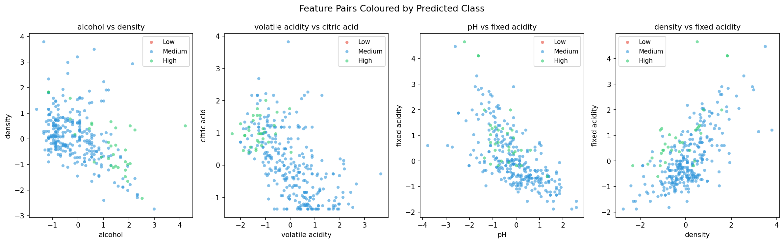

# Logistic Regression from Scratch
### Classifying Red Wine Quality with Softmax Regression and Gradient Descent

---

## Overview

This project implements multiclass logistic regression entirely from scratch
using NumPy. Without sklearn. Every component is
built explicitly. softmax activation, cross-entropy loss, analytical
gradient derivation, and gradient descent training loop.

**A note on naming:** Multiclass logistic regression is implemented via the
softmax function. The natural generalisation of the binary sigmoid to multiple classes. Naming this project "Logistic Regression" is deliberate:
softmax is not a departure from logistic regression, it is its multiclass
form.

This is **Part 2 of a 4-project series** building core ML algorithms from
scratch. Part-1 covered linear regression. Here we extend gradient descent to a
classification setting.

---

## The Math

**Softmax activation** converts raw scores into a probability distribution:

$$\sigma(z)_k = \frac{e^{z_k - \max(z)}}{\sum_{j=1}^{K} e^{z_j - \max(z)}}$$

**Cross-entropy loss** measures how wrong the probabilities are:

$$J(W, b) = -\frac{1}{m} \sum_{i=1}^{m} \sum_{k=1}^{K} Y_{ik} \log(\hat{Y}_{ik})$$

**Gradient of loss with respect to weights(W,b)** elegant closed form result
of pairing softmax with cross-entropy:

$$\frac{\partial J}{\partial W} = \frac{1}{m} X^T(\hat{Y} - Y)$$

**Gradient descent update:**

$$W := W - \alpha \cdot \frac{\partial J}{\partial W} \qquad b := b - \alpha \cdot \frac{\partial J}{\partial b}$$

---

## Dataset

**Red Wine Quality** — UCI Machine Learning Repository
- 1,599 samples, 11 features
- Features: fixed acidity, volatile acidity, citric acid, residual sugar,
  chlorides, free sulfur dioxide, total sulfur dioxide, density, pH,
  sulphates, alcohol
- Target: quality score bucketed into 3 classes — Low (3–4), Medium (5–6),
  High (7–9)
- Class distribution: Low 13 · Medium 1382 · High 217. It's imbalanced

---

## Results

| Metric | Value |
|--------|-------|
| Test Accuracy | 85.00% |
| Final Validation Loss | 0.401938 |
| Best F1 | Medium — 0.9130 |
| Worst Recall | Low — 0.0000 |

**Classification Report:**

| Class | Precision | Recall | F1 | Support |
|-------|-----------|--------|----|---------|
| Low | 0.0000 | 0.0000 | 0.0000 | 13 |
| Medium | 0.8750 | 0.9545 | 0.9130 | 264 |
| High | 0.6250 | 0.4651 | 0.5333 | 43 |

---

## Plots

### Training Loss


Train and validation loss plotted across 1,000 epochs. Both curves
descending together confirm the model is generalising rather than
overfitting — a divergence between the two would signal overfitting
and the need for early stopping or regularisation.

Loss dropped from the expected initial value of log(3) ≈ 1.0986 to 0.4049,
confirming convergence. The horizontal dashed line marks the final loss.

### Confusion Matrix


### Feature Pairs Coloured by Predicted Class


Medium dominates all three plots, a direct visual confirmation of the
class imbalance problem discussed in limitations.

---

## Key Implementation Decisions

- **Scaling:** Z-score standardisation implemented manually in NumPy.
  Empirically compared against Min-Max normalisation. Z-score won on
  validation accuracy
- **Learning rate:** α = 0.1, selected by comparing 0.001, 0.01, and 0.1
  over 500 epochs
- **Split:** 60/20/20 with `stratify=y` to preserve class proportions across train, validation and test sets the only sklearn call in the project
- **Initialisation:** Weights initialised to zero — valid for single-layer
  softmax, breaks down in multi-layer networks

---

## Limitations

**Class imbalance without correction** the model never predicted Low
once across 320 test samples. Standard cross-entropy treats all
misclassifications equally, giving the model no incentive to learn
minority classes. Class-weighted loss would address this directly.

**Linear decision boundaries** softmax regression can only separate
classes with a hyperplane. Wine quality is unlikely to be linearly
separable from chemical measurements alone.

**85% accuracy is misleading** a model predicting Medium for every
sample would achieve ~82.5% accuracy on this dataset. The model is only
marginally better than that naive baseline.

---

## What I Would Try Next

- Class-weighted cross-entropy loss — penalise Low and High
  misclassifications more heavily
- L2 regularisation — add weight penalty to reduce majority class bias
- **Part 3 of this series: PCA Visualiser** — reduce 11 features to 2
  principal components and visualise class separation in the directions
  of maximum variance

---

## Part of a Series

| # | Project | Status |
|---|---------|--------|
| 1 | [Linear Regression from Scratch](https://github.com/groovyds/linear-regression) | ✅ Complete |
| 2 | Logistic Regression from Scratch | ✅ Complete |
| 3 | PCA Visualiser | 🔄 Up next |
| 4 | Naive Bayes Classifier | ⏳ Upcoming |

---

## Setup

```bash
git clone https://github.com/groovyds/logistic-regression
cd logistic-regression
pip install -r requirements.txt
```

Open `logistic-regression.ipynb` and run all cells
in order. Place `winequality-red.csv` in the root directory before running.

---

## Dependencies

```
numpy
pandas
matplotlib
scikit-learn
jupyter
```